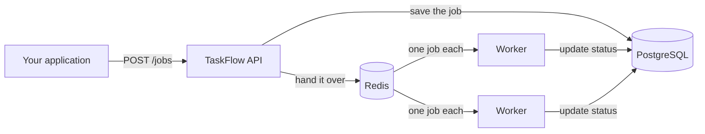
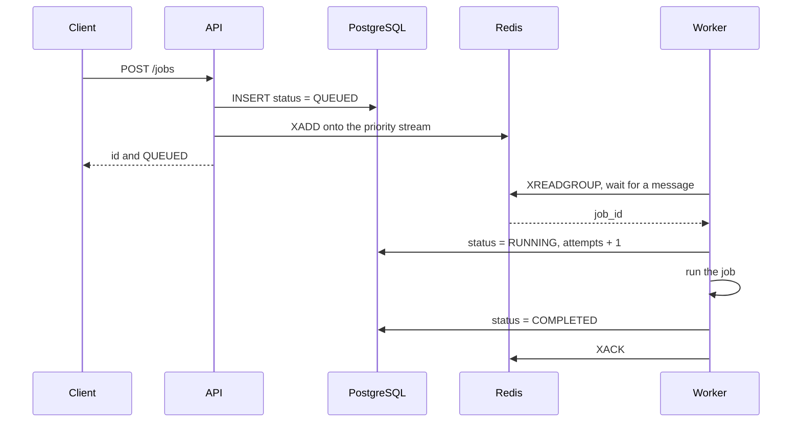
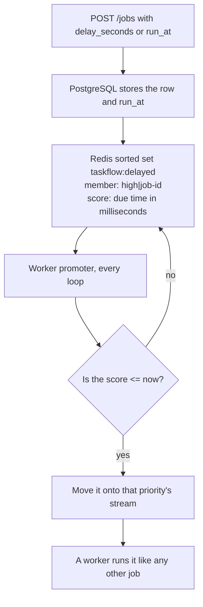
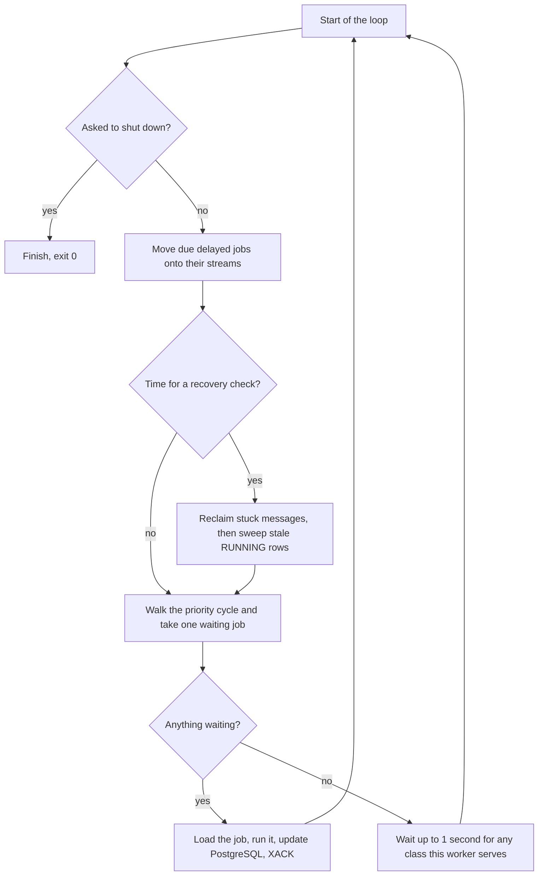
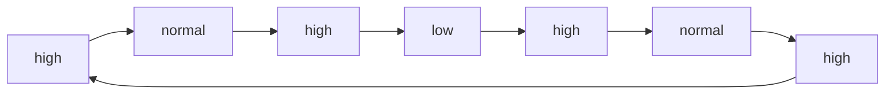
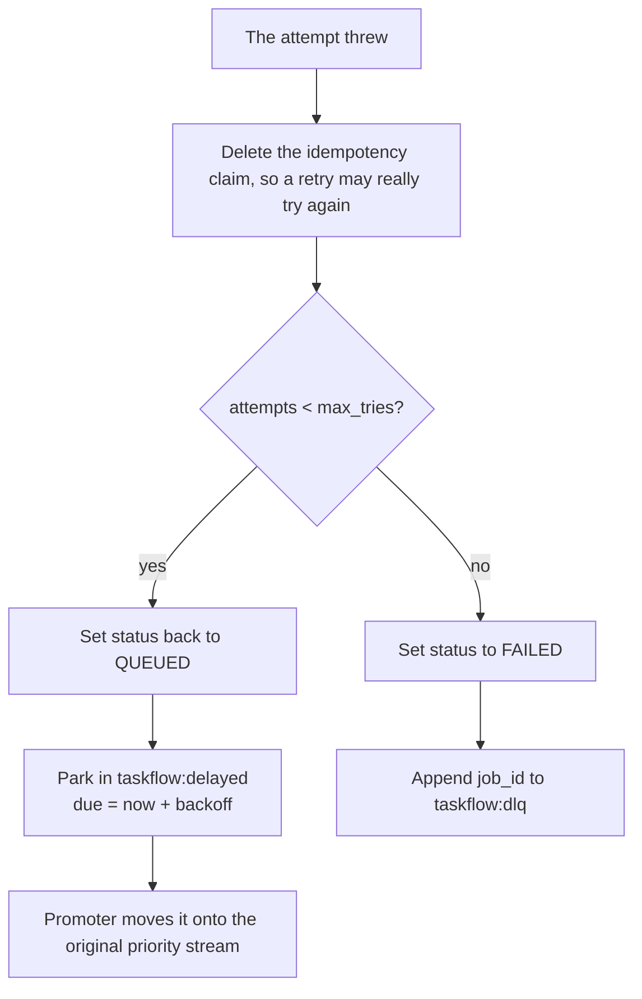
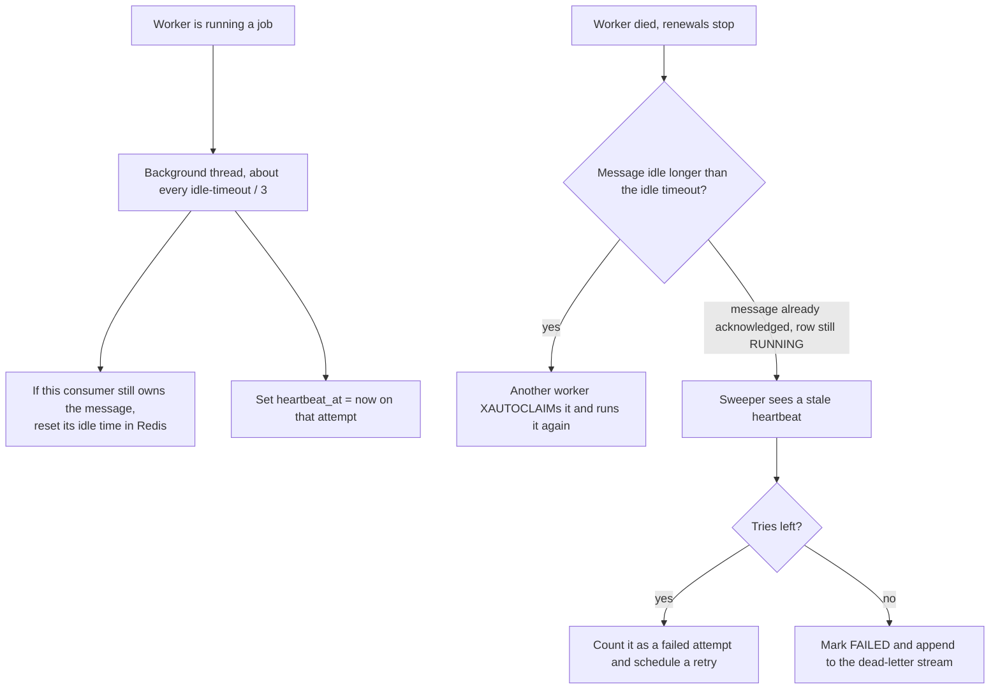
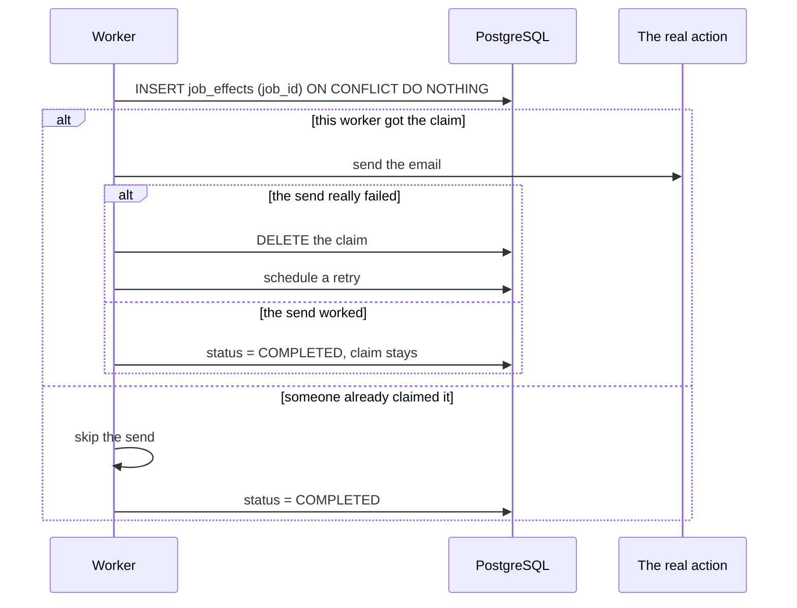

# TaskFlow

TaskFlow is a small distributed background-job system. An application hands it a job over HTTP. TaskFlow stores the job, lines it up, and a worker process runs it later. Several workers can share the work.

The project name in the build is `distributed_job_platform`. The running system is called TaskFlow.

One sentence to keep straight the whole way through:

**PostgreSQL remembers what the job is and what happened to it. Redis hands the job to a worker.**



## What each part does

| Part | What it is | What it is for |
|---|---|---|
| API | C++ program using [Drogon](https://drogonframework.github.io/drogon-docs/) | Accepts jobs over HTTP and writes them down |
| PostgreSQL | Database `taskflow` | The durable record: status, payload, tries, schedule |
| Redis | Streams, one sorted set, one dead-letter stream | The line of work workers pull from |
| Worker | C++ program, one process per worker | Waits for a job, runs it, writes the result back |

Redis is not a second copy of the job. A stream message usually contains only `job_id`. The worker reads that id, then loads the real payload from PostgreSQL.

## How the code is laid out

The programs that actually run are small. Almost all of the behavior is in two files.

```text
src/api/main.cpp              HTTP API
src/worker/main.cpp           worker loop
src/config/Config.h           hosts, ports, password, from environment variables
src/common/models/Job.h       status and priority values
docker/init.sql               tables, applied on a brand-new Postgres volume
docker/api.Dockerfile         API image
docker/worker.Dockerfile      worker image
docker-compose.yml            Redis, Postgres, API, and worker together
tests/                        integration tests against the real binaries
```

These files exist and are empty. The build does not compile them. They are leftovers from an earlier sketch of a split into controllers and services:

```text
src/api/controllers/JobController.cpp
src/api/routes/Routes.cpp
src/api/services/JobService.cpp
src/common/database/Database.cpp
src/common/queue/RedisQueue.cpp
src/worker/JobExecutor.cpp
src/worker/Worker.cpp
```

## A job, from submit to done



Statuses:

| Status | Meaning |
|---|---|
| `QUEUED` | Saved, waiting for a worker, or waiting for its scheduled time, or waiting out a retry delay |
| `RUNNING` | A worker has claimed it and is in the middle of the attempt |
| `COMPLETED` | The attempt finished successfully |
| `FAILED` | Every allowed attempt has failed. The job is dead until someone redrives it |

`attempts` starts at 0 and goes up by one each time a worker claims the job. `max_tries` defaults to 3. The API does not let the caller change `max_tries`.

## Submitting a job

`POST /jobs` with a JSON body.

```json
{
  "type": "email",
  "payload": "send welcome email",
  "priority": 2
}
```

A normal success looks like:

```json
{
  "id": "job-3f2a...uuid...",
  "status": "QUEUED"
}
```

The id is `job-` plus a UUID, generated in the API process.

| Field | Required | What happens |
|---|---|---|
| `type` | yes | Stored as text. The worker only knows how to run `email` |
| `payload` | yes | Stored as text. The worker also looks inside it for test words (`fail`, `crash`) |
| `priority` | no | `0` low, `1` normal, `2` high. Omitted means normal. A value that is not a whole number is rejected. Any other whole number is stored as normal (`1`) |
| `delay_seconds` | no | Run this many seconds from now. A number from 0 to 3153600000 |
| `run_at` | no | Run at this timestamp, for example `2026-10-01T15:00:00Z`. Include a timezone (`Z` or an offset like `+05:30`) |

`delay_seconds` and `run_at` are optional, and they are not allowed together.

Bad input returns HTTP 400 and a JSON body `{"error": "..."}`. Nothing is stored. A database failure returns HTTP 500 with a plain-text body starting `Database error:`.

There is no `GET /jobs` yet, and no health route. The API listens on `0.0.0.0` and `TASKFLOW_API_PORT` (default `8080`).

### Immediate job

No `delay_seconds` and no `run_at`. After the database commit, the API adds the id to the stream for that priority:

```text
XADD taskflow:jobs:high   * job_id <id>     priority 2
XADD taskflow:jobs:normal * job_id <id>     priority 1
XADD taskflow:jobs:low    * job_id <id>     priority 0
```

`*` asks Redis to invent the message id.

### Scheduled job



PostgreSQL does the time math. For a delay it stores `now() + that many seconds`. For `run_at` it parses the timestamp. It returns the due time as epoch milliseconds, and that number is the score in Redis.

The sorted-set member looks like `high|<job id>`, so the promoter knows which stream to use without reading PostgreSQL.

The API response for a scheduled job also includes `run_at_ms`.

A time in the past is accepted. The job is already due, so the next promoter pass moves it onto the stream.

### If Redis does not accept the job

The database commit happens first. Then the API talks to Redis. If that second step fails, the job row is already `QUEUED`, the API still returns `QUEUED`, and it only writes an error to its log. The worker will not see the job, because it never scans the table for work that Redis does not know about. The same hole exists when a retry or the sweeper tries to schedule a job and Redis fails. Closing that hole is the next piece of work.

## What Redis is holding

| Key | Type | What is in it |
|---|---|---|
| `taskflow:jobs:high` | stream | High-priority work, ready to run |
| `taskflow:jobs:normal` | stream | Normal work, ready to run |
| `taskflow:jobs:low` | stream | Low-priority work, ready to run |
| `taskflow:delayed` | sorted set | Jobs whose time has not come yet, including retries. Score is the due time in epoch milliseconds |
| `taskflow:dlq` | stream | Jobs that have permanently failed |

All three job streams share one consumer group, `taskflow-workers`. A consumer group is how several workers share a stream: each message is delivered to one consumer, not copied to all of them.

A message that has been delivered but not acknowledged sits in the pending entries list (the PEL). `XACK` removes it from that list. `>` in `XREADGROUP` means "only messages nobody in this group has been given yet."

The first worker to start creates the group on each stream with `XGROUP CREATE ... 0 MKSTREAM`. Starting at `0` means jobs that were submitted before any worker existed are still delivered. `MKSTREAM` creates the stream if it is missing. If the group already exists, Redis returns `BUSYGROUP` and the worker continues.

## What the worker does on every pass



The one-second wait is there so a quiet worker still returns to the promoter and the reaper. It does not sit blocked forever.

Each worker has its own consumer name:

1. `TASKFLOW_WORKER_NAME`, if you set it
2. otherwise `worker-` plus the machine's `HOSTNAME` (Docker sets a different hostname on every container, including scaled copies)
3. otherwise `worker-` plus the process id

The hostname fallback matters because a container's main process is almost always PID 1. PID alone would make every scaled worker look like the same Redis consumer.

The worker logs a line and flushes it immediately, so `docker logs` and the test harness see output while the process is still running.

## Priority

A Redis stream is strictly first in, first out. Priority is expressed by using three streams, not by sorting inside one stream.

Each worker has weights `high,normal,low`. The default is `4,2,1`, from `TASKFLOW_WEIGHTS`. A weight of `0` means this worker never takes that class. `0,0,1` is a worker that only runs low jobs. If every weight is `0`, the worker exits at startup.

The weights become a repeating cycle that spreads the turns out, instead of running four high jobs in a burst and then the rest:

```text
4,2,1  →  high, normal, high, low, high, normal, high,  and then again
```



On each pass the worker starts where it left off and takes the first class in that cycle that actually has a job. Empty classes are skipped, so a low job runs immediately when nothing else is waiting. It does not sit there until its "turn" on an idle system.

When every class is backed up, high jobs come up more often, and low jobs still come up. A flood of high jobs does not block low jobs for the whole flood.

A retry goes back to the same priority stream the job started on.

## Running the job

The worker claims the row in one statement:

```sql
UPDATE jobs
SET status = 'RUNNING', attempts = attempts + 1, heartbeat_at = now()
WHERE id = $1 AND status NOT IN ('COMPLETED', 'FAILED')
RETURNING type, payload, attempts, max_tries, priority
```

A job that is already `COMPLETED` or `FAILED` is not run again. The message is acknowledged and dropped. That covers a duplicate or a stale message for work that already finished.

If the id in the message has no row, or the message has no `job_id` field, the worker logs that and acknowledges the message so it does not sit pending forever.

The only implemented type is `email`. The worker sleeps about half a second and logs that it sent the email. Any other type is logged as unknown and then marked `COMPLETED`. There is no plugin system for job types yet.

Three words in an email payload are temporary test hooks, compiled into the worker:

| Payload contains | What the worker does |
|---|---|
| `fail` | Throws, so this attempt fails |
| `crash` | Sleeps 20 seconds before the send, so you can kill the process mid-job |
| `crash-after-send` | Sleeps 20 seconds after the send, so you can kill it once the action has already happened |

`crash` does not match a payload that also says `crash-after-send`. The two hooks stay independent.

## If the attempt fails



Backoff is fixed in the worker for now, not chosen per job type:

```text
delay = min(2 seconds × 2^(attempts - 1), 60 seconds)
```

After the first failure the wait is 2 seconds, then 4, then 8, and so on, never more than 60 seconds. The exponent is capped so the shift cannot overflow.

The final status write is fenced:

```sql
UPDATE jobs SET status = $3
WHERE id = $1 AND attempts = $2 AND status = 'RUNNING'
```

`$2` is the attempt number this worker started with. If that row was no longer ours, the update changes zero rows. This worker throws its result away and does not acknowledge the Redis message. The worker that owns the message now is the one that will acknowledge it.

## If the worker dies in the middle

A crash is not a clean shutdown. The process is gone, the message is still pending, and the row may still say `RUNNING`.

Two clocks protect a live worker, and two mechanisms clean up a dead one.



Defaults, overridable with environment variables:

| Variable | Default | Meaning |
|---|---|---|
| `TASKFLOW_REAP_IDLE_MS` | 60000 | How long a message may sit without a renewal before another worker may take it |
| `TASKFLOW_REAP_CHECK_MS` | 10000 | How often each worker looks for those stuck messages |

The lease thread renews at one third of the idle timeout (every 20 seconds with the defaults). A healthy job can run much longer than 60 seconds, because the renewal keeps resetting the idle time. The reaper is for workers that stopped renewing, not for slow jobs.

The renewal only succeeds if this consumer still owns the message. A worker that already lost the job cannot grab it back.

The database sweeper waits twice as long as the idle timeout (120 seconds by default). That gives the Redis reaper the first chance. The sweeper exists for the case Redis cannot fix: the message was acknowledged, but the final status write never landed, so the row is stuck on `RUNNING`. Several workers may sweep at once. The query locks rows with `FOR UPDATE SKIP LOCKED`, so two sweepers do not both requeue the same job.

`XAUTOCLAIM` is the reaper command. It takes pending messages on a stream whose idle time is over the limit and assigns them to the worker that asked.

## Doing the real action only once

Fencing stops a stale worker from writing the status twice. It does not, by itself, stop the real action from running twice. The dangerous moment is: the send succeeded, then the process died before it could say `COMPLETED`. The reaper would run the job again.

`job_effects` is the ledger for that.



The claim is inserted before the send. If the worker dies after a successful send, the row is still there, and the next attempt skips the send. If the worker dies during the send, the claim is also already there, so that case is treated as "maybe it went out, do not send again." That is a deliberate choice: a duplicate email is treated as worse than a skipped retry of an uncertain send.

If the attempt throws, the worker deletes the claim, so the next try is allowed to send for real.

## Dead letters and redrive

When the last allowed attempt fails, or the sweeper gives up on a stuck job that is out of tries, the status becomes `FAILED` and the id is appended to `taskflow:dlq`. Jobs that succeed, and jobs that still have retries left, are not written there.

`POST /jobs/<id>/redrive` gives a dead job a new budget:

1. The row must currently be `FAILED`. Anything else, including an unknown id, returns HTTP 404 and changes nothing.
2. Status goes back to `QUEUED` and `attempts` goes back to 0. `max_tries` stays 3.
3. Any leftover `job_effects` row is deleted, so the new run is allowed to perform the action again.
4. The id is placed on the original priority stream.

```json
{ "id": "job-...", "status": "QUEUED" }
```

The old dead-letter message is not removed from `taskflow:dlq`. The stream is a record that the job died. The new attempt is a new message on the priority stream.

## Stopping a worker

The first Ctrl+C, SIGTERM, or `docker stop` means: do not take another job, finish the one in hand, acknowledge it, exit 0. The check happens at the start of the loop, so a job already started is always finished, including the retry schedule if that job failed.

A second signal exits immediately with code 130. The job in hand stays `RUNNING` and is recovered later the same way as a crash.

`docker-compose.yml` gives the worker 60 seconds after SIGTERM before Docker sends SIGKILL. That has to be longer than the job you expect to finish. The Dockerfiles start the binary as PID 1, so SIGTERM reaches the worker instead of being swallowed by a shell.

## More than one worker

Every worker joins the same consumer group and runs the same loop: promote due jobs, reclaim stuck messages, sweep stale rows, then take new work. Redis gives each new message to one of them.

`docker compose up --build --scale worker=3` starts three workers. Compose names each container, and that name becomes `HOSTNAME`, which becomes the Redis consumer name. The worker service has no fixed `container_name`, because a fixed name cannot be scaled.

## Settings

Every value comes from the environment. Defaults match a database and Redis on this machine. The password has no default. If `TASKFLOW_DB_PASSWORD` is missing, the API and the worker exit immediately.

| Variable | Default | Used by |
|---|---|---|
| `TASKFLOW_REDIS_HOST` | `127.0.0.1` | API, worker |
| `TASKFLOW_REDIS_PORT` | `6379` | API, worker |
| `TASKFLOW_REDIS_DB` | `0` | API, worker. `0`–`255`. A non-zero value runs Redis `SELECT` |
| `TASKFLOW_DB_HOST` | `localhost` | API, worker |
| `TASKFLOW_DB_PORT` | `5432` | API, worker |
| `TASKFLOW_DB_NAME` | `taskflow` | API, worker |
| `TASKFLOW_DB_USER` | `postgres` | API, worker |
| `TASKFLOW_DB_PASSWORD` | required | API, worker |
| `TASKFLOW_API_PORT` | `8080` | API |
| `TASKFLOW_WORKER_NAME` | see above | worker |
| `TASKFLOW_WEIGHTS` | `4,2,1` | worker. `high,normal,low`, each a non-negative integer |
| `TASKFLOW_REAP_IDLE_MS` | `60000` | worker |
| `TASKFLOW_REAP_CHECK_MS` | `10000` | worker |

Inside Compose, the hostnames are the service names: `TASKFLOW_REDIS_HOST=redis` and `TASKFLOW_DB_HOST=postgres`.

Redis connections give up after 5 seconds instead of hanging. The API opens one PostgreSQL connection and one Redis connection at startup and uses them for every request. The worker's main thread has its own pair, and the lease thread has another pair. Those libraries are not shared across threads. One shared API connection is enough for a single tester and is not a safe pool for overlapping requests.

## Database

`docker/init.sql` runs only the first time the Postgres volume is empty. A database that already exists does not pick up later edits to that file by itself.

`jobs`

| Column | Meaning |
|---|---|
| `id` | Primary key, `job-` plus a UUID |
| `type` | Job type, for example `email` |
| `payload` | Text the worker interprets |
| `status` | `QUEUED`, `RUNNING`, `COMPLETED`, or `FAILED` |
| `priority` | `0` low, `1` normal, `2` high |
| `attempts` | How many times a worker has claimed it |
| `max_tries` | Stop and fail after this many claims. Default 3 |
| `heartbeat_at` | Last proof that the worker on this attempt is alive. Null if it never heartbeated |
| `run_at` | When a scheduled job is due. Null for a job that should run immediately |

`job_effects`

| Column | Meaning |
|---|---|
| `job_id` | Primary key, and a foreign key to `jobs`. Deleting the job deletes the claim |
| `claimed_at` | When this job won the right to perform its action |

## Build and run

You need a C++ compiler, CMake, Drogon, libpqxx, hiredis, a running PostgreSQL with the `taskflow` database and the tables above, and Redis.

On Windows the dependencies come from vcpkg, and `CMakeLists.txt` expects them at `X:/codes/vcpkg/installed/x64-windows`. Change `VCPKG_INSTALLED` if yours lives somewhere else. The project is built as C++20 there. Before starting either executable, the vcpkg DLLs have to be on `PATH`:

```powershell
$env:PATH = "X:\codes\vcpkg\installed\x64-windows\bin;$env:PATH"
$env:TASKFLOW_DB_PASSWORD = "your-password"
cmake -S . -B build
cmake --build build --config Debug
.\build\Debug\distributed_job_platform-api.exe
.\build\Debug\distributed_job_platform-worker.exe
```

On Linux, including inside the Docker build, the project is C++17 and links the apt packages. Ubuntu's libpqxx package does not match a C++20 build, and its Drogon CMake package pulls in MySQL in a way that fails here, so `CMakeLists.txt` takes a different path on that platform.

### Docker Compose

Copy `env.example` to `.env` in the repo root and set `TASKFLOW_DB_PASSWORD`. Compose reads `.env` by itself.

```powershell
docker compose up --build
docker compose up --build --scale worker=3
docker compose down
```

`docker compose down -v` also deletes the Postgres volume. The next start runs `init.sql` again.

Redis and Postgres are not published to the host, so they do not collide with a local Redis on 6379 or a local Postgres on 5432. From another shell:

```powershell
docker compose exec redis redis-cli
docker compose exec postgres psql -U postgres -d taskflow
```

The API is published on port 8080.

```powershell
curl.exe -X POST http://localhost:8080/jobs -H "Content-Type: application/json" -d "{\"type\":\"email\",\"payload\":\"send welcome email\",\"priority\":2}"
```

Images are Ubuntu 24.04, built in two stages. The build stage has the compiler. The runtime stage has the shared libraries and a non-root user `taskflow`. The worker image does not install Drogon.

## Tests

`tests/` is an integration suite. It starts the real worker executable, and for API tests the real API executable, against a real Redis on `127.0.0.1:6379` and PostgreSQL on `localhost:5432` database `taskflow`. It does not use mocks.

```powershell
pip install -r tests/requirements.txt
$env:TASKFLOW_DB_PASSWORD = "your-password"
pytest tests -v
pytest tests -v -m "not slow"
```

`slow` tests use the 20-second hang hook. The suite refuses to start if the binary is older than `src/worker/main.cpp`, if a worker of yours is already consuming, if non-test jobs are stuck `RUNNING`, or if real jobs are waiting in Redis. Test rows use ids starting with `test-`, or payloads starting with `apitest-`.

| File | What it checks |
|---|---|
| `tests/test_api.py` | Validation, priority routing, `delay_seconds`, `run_at`, and one job submitted through the API that runs when it is due |
| `tests/test_worker.py` | Completing, poison messages, backoff, two workers splitting a batch, leases, crash reclaim, fencing, the sweeper |
| `tests/test_priority.py` | The `4,2,1` order, low jobs under a high-job flood, weight `0`, retries staying on the original stream |
| `tests/test_scheduling.py` | Not running early, due-time order, a job that became due while no worker was up |
| `tests/test_shutdown.py` | Finish the current job, leave the rest queued, a second signal exits at once |
| `tests/test_idempotency_dlq.py` | One send, a crash after the send, the dead-letter stream, redrive |

`.gitignore` currently ignores `tests/`, so Git does not track this suite.

## What is not built yet

The pipeline above is the system as it stands. These pieces are still open:

- A job saved in PostgreSQL and then lost on the way into Redis is not retried.
- The API has one shared database connection, no `GET` for a job, and no authentication.
- Job types other than a simulated email, per-type retry settings, and stored error text or results.
- Metrics (Prometheus and Grafana), load-test numbers, and a dashboard.

`plan.txt` is the original order of those later stages. `TASKFLOW_PROJECT_STATE.md` is an older handoff note from before this pipeline existed. The code and this file are the current description.
